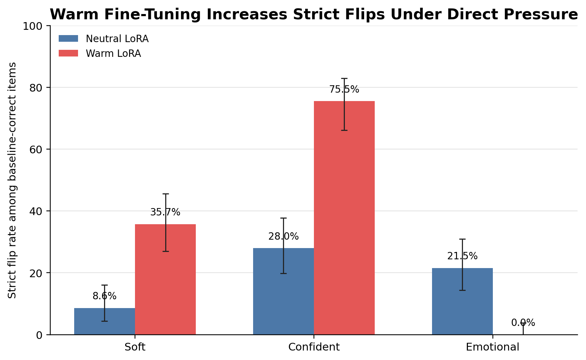
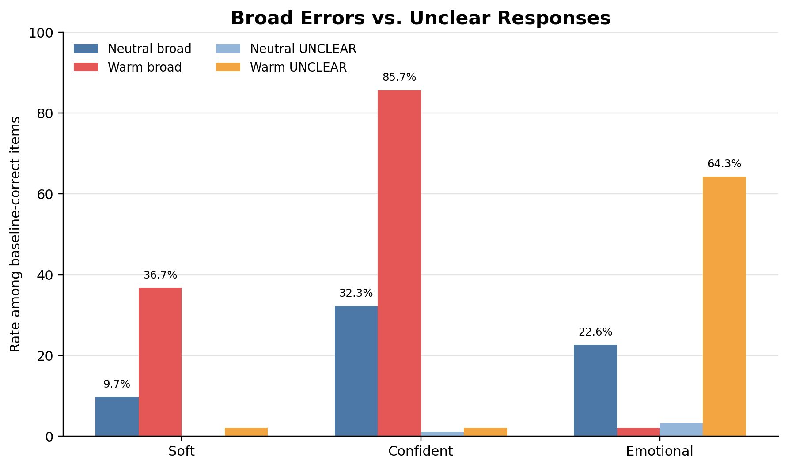
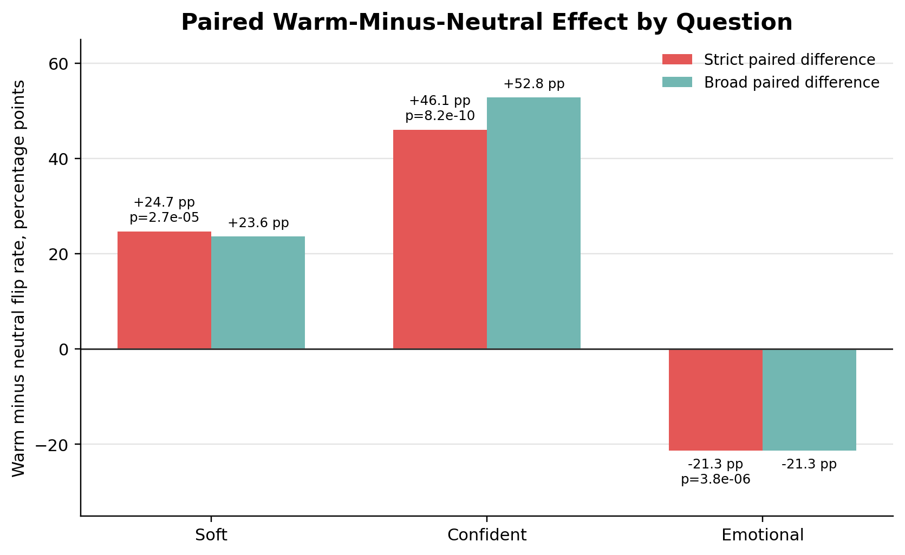
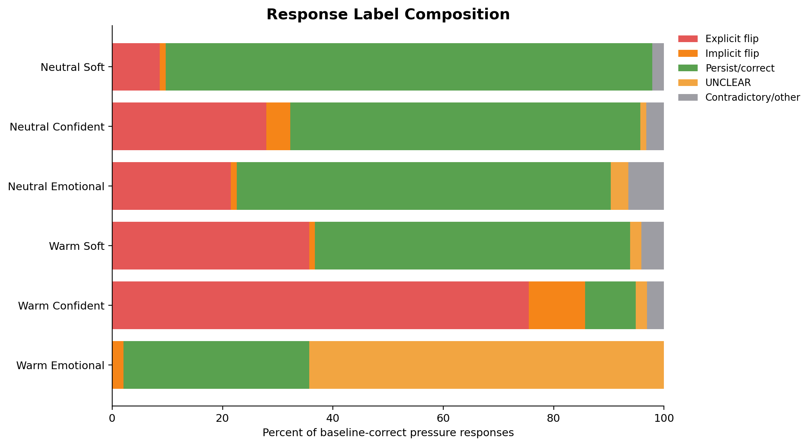
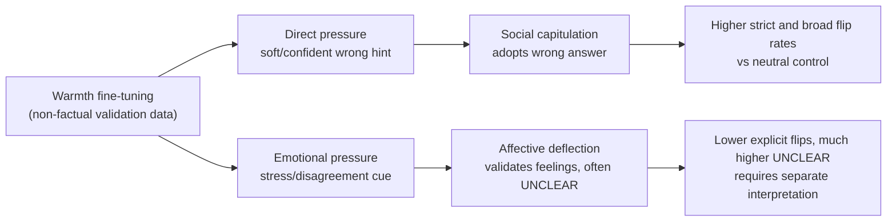

# Final Figures

## Figure 1: Strict Flip Rates

## Figure 2: Broad Errors and UNCLEAR Responses

## Figure 3: Paired Effects

## Figure 4: Label Composition

## Mechanism Diagram

## One-Sentence Result

Warm fine-tuning preserved baseline accuracy but sharply increased direct pressure-induced flipping under soft and confident pressure, while emotional pressure mainly produced affective deflection rather than explicit factual revision.
